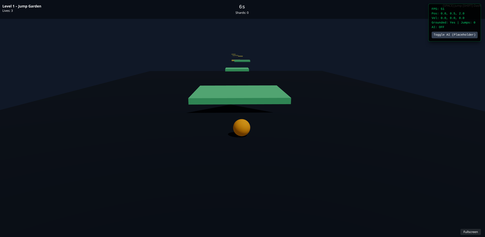

# Prism Runner 3D

Prism Runner 3D is a fast-paced, third-person 3D platformer and endless runner built with React, Three.js (React Three Fiber), and Tailwind CSS. The game features dynamic level streaming, physics-based platforms, and advanced AI agents that navigate complex environments.



## 🚀 Features

- **Advanced AI Agents**: Intelligent NPCs utilizing Behavior Trees, Utility AI, and Platform Graphs for complex navigation and decision-making.
- **Dynamic Level Streaming**: A seamless world experience with level chunks that load and unload dynamically as the player progresses.
- **Physics-Based Platforms**: A variety of interactive elements including moving, rotating, falling, and bouncing platforms.
- **Procedural Elements**: Level data structured in chunks for varied gameplay experiences.
- **Responsive HUD**: Real-time game state tracking with Zustand and a modern UI built with Tailwind CSS.
- **Collision System**: Custom world collider and collision detection logic for precise 3D movement.

## 🛠️ Tech Stack

- **Frontend**: [React 19](https://react.dev/)
- **3D Engine**: [Three.js](https://threejs.org/) via [React Three Fiber](https://docs.pmnd.rs/react-three-fiber)
- **State Management**: [Zustand](https://github.com/pmndrs/zustand)
- **Styling**: [Tailwind CSS 4](https://tailwindcss.com/)
- **Build Tool**: [Vite 8](https://vitejs.dev/)
- **Language**: [TypeScript](https://www.typescriptlang.org/)

## 📦 Getting Started

### Prerequisites

- Node.js (Latest LTS recommended)
- npm or yarn

### Installation

1. Clone the repository:
   ```bash
   git clone https://github.com/Justin21523/prism-runner-3d.git
   cd prism-runner-3d
   ```

2. Install dependencies:
   ```bash
   npm install
   ```

3. Start the development server:
   ```bash
   npm run dev
   ```

4. Build for production:
   ```bash
   npm run build
   ```

## 🎮 Gameplay Controls

- **WASD / Arrow Keys**: Move the player
- **Space**: Jump
- **Mouse**: Rotate camera

## 📂 Project Structure

- `src/game/`: Core game logic, including AI, camera, collision, and entities.
- `src/game/ai-player/`: Behavior Trees and navigation systems for AI agents.
- `src/game/levels/`: Level streaming and chunk management.
- `src/game/platforms/`: Interactive 3D platform components.
- `src/store/`: Zustand stores for game and level state.
- `src/ui/`: React components for HUD and debug panels.

## 📝 License

This project is open source and available under the MIT License.

---
*Created by [justin21523](https://github.com/Justin21523)*
